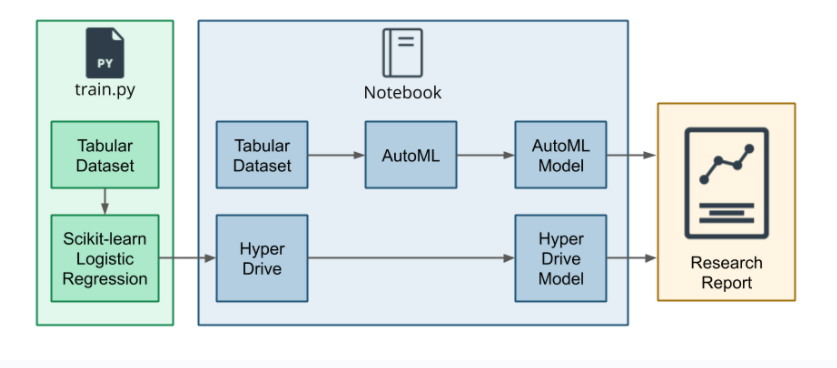
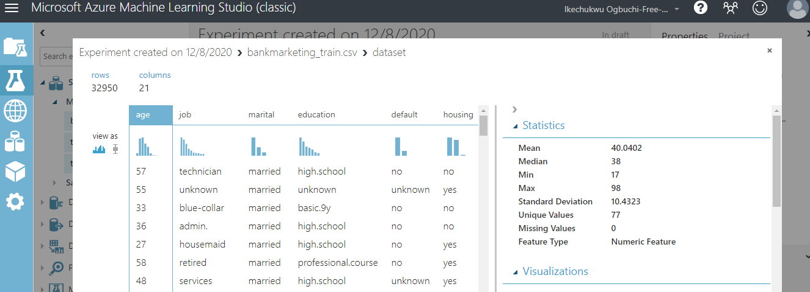
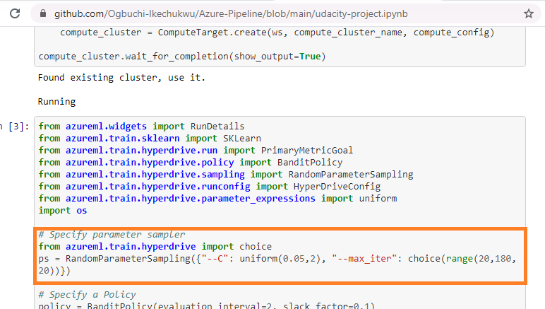
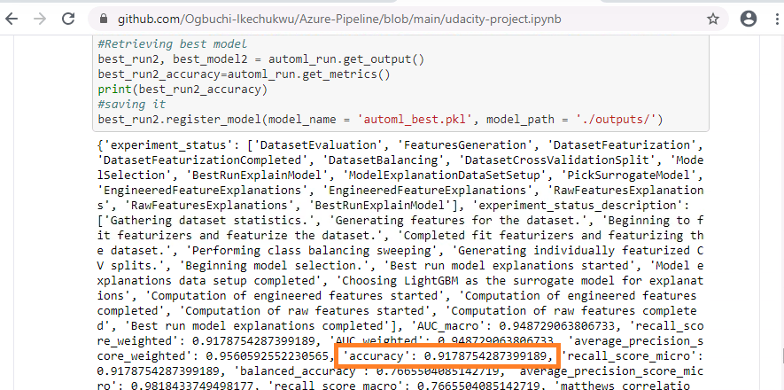
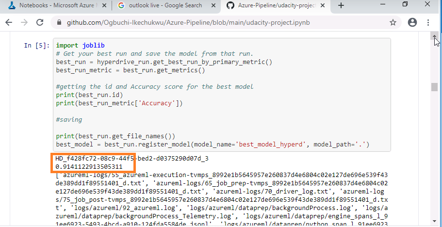

# Optimizing an ML Pipeline in Azure by Ikechukwu Nigel Ogbuchi #

## Overview
The goal of this project was to build and optimize a Machine Learning Pipeline. I was provided with a custom made model, “the Scikit-learn Logistic regression algorithm”, for this purpose and had to optimize the hyperparameters needed by the algorithm using Hyperdrive for the first part. I also had to use AutoML to build and optimize a model on the same dataset, then compared the results in term of certain metrics.
HyperDrive is a software package that helps you automate and choose hyperparameters for your ML algorithms alongside possible configurations to identify the best performing values.
Automated machine learning, also referred to as automated ML or AutoML, is the process of automating the time consuming, iterative tasks of machine learning model development. It allows data scientists, analysts, and developers to build ML models with high scale, efficiency, and productivity all while sustaining model quality.

## Summary of the Problem:
I needed to solve a machine learning classification problem to predict the class Yes or No if the client will subscribe to a term deposit (column y) from given data from a Bank’s marketing data. From analysis of the data, it had about 32000 features. The problem is to build classification models using various tools on Azure and optimize them through hyperparameter tuning and comparisons.

## How it was solved:
My solution was first to apply logistic regression to solve this problem on Python SDK and Hyperdrive, then I used AutoML as well to address the problem and compare accuracies. It involved a train.py script, a jupyter notebook and Azure compute resources. I used the train script to pull the data from web source and save it in needed format, I visualized the data using Azure studio Classic then cleaned the data set and proceeded to split using Scikit Learn’s train_test_split. 
Then I went to the Jupiter notebook to setup the Hyperdrive configs to be able to utilize the train script for operation after I had set up our compute cluster and workspace.
After it ran successfully as evidenced in my jupyter notebook, I saved the best Hyperdrive model then I proceeded with setup for the AutoML as shown in my notebook. After setting up parameters, the training was completed and I saved the best model while printing out my accuracy.

## Explanation of Architecture, Data, Hyperparameters and Algorithms
Here is a pictorial architecture of what I did:

 
From exploration of the data I had been given to work with, there are 21 identified columns some of which are Id, age, job, marital, education, default, housing, loan and other column names showing some details about each customer. There are exactly 32950 rows of data. Median age of customers sampled was 38. A picture is shown below:
 
 
 
The algorithm used was the logistic regression which has the advantage of being easier to implement and interpret.
Hyperparameters I chose for the HyperDrive range were uniform (0.05,2), this returns a value uniformly distributed between low and high, in this case between 0.05 as lowest and 2 as highest. I also included a range of values (20,180,20) using “choice” for the model to perform maximum of iterations.
 
 
 
## Explanation of The Rationale for Choosing a Particular Parameter sampler
I chose the Random Sampler because it has the advantage of quickly identifying the right configuration of hyperparameters by using randomly selected values. It is faster because it does not search sequentially like the Grid sampler and it is very suitable for the early stopping policy which aims to prevent overfitting. 

## Explanation of the Rationale for Choosing a Particular Early Stopping Policy
I chose the BanditPolicy as my early stopping policy. It defines an early termination policy based on slack criteria, and a frequency and delay interval for evaluation. Because it allows me set the parameters of slack_factor, evaluation_interval and delay evaluation, it gives me a good control of tuning my stopping policies as I see fit.

## Description of Model and HyperParameters produced by AutoML
There were 28 models from my AutoML run and the best performing one was the “VotingEnsemble” which gave me an accuracy of 91.79%. Automated machine learning picks an algorithm and hyperparameters for you and generates a model ready for deployment.
 
 

## Comparison of the Models and their Performance
The logistic regression created using HyperDrive gave me an accuracy of 91.41% while AutoML gave me 91.79%. The difference appears fractional, but it could mean a lot depending on the size of data involved. Based on this, AutoML performed better.

 
## Identification of Areas to Improve
I can improve accuracy on the Hyperdrive logistic regression model by expanding the range of hyperparameters from which my hyperdrive can automate, I can also try out other classification algorithms from the PythonSDK to compare how they fare over the custom coded Logistic regression algorithm that I used.

## Cleanup
I cleaned up the cluster after use as shown in my notebook. Code cell 20.

